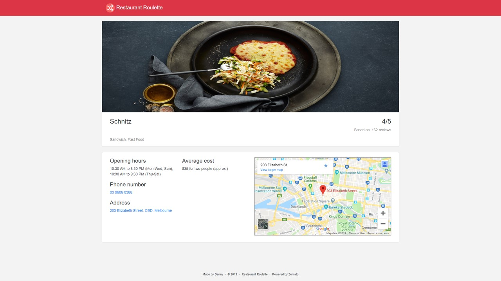

## RestaurantRoulette

Restaurant Roulette is a web application that sugguests users a random restaurant. 
It uses the user's input location to find a restaurant within their proximity. Users can also select based on meal types (breakfast, lunch, dinner and delivery) which will find a restaurant using their current location.

The application was developed to combat indecisiveness among my friends when deciding on which restaurant to dine at.

## Technology and knowledge

The application was developed using ASP.Net Core and [Zomato's API](https://developers.zomato.com/api) to search for restaurants.
In developing this application, I practiced HTML, CSS, JavaScript, C# and learnt how to deserialize JSON data in MVC.

## Acknowledgements

[Zomato](https://developers.zomato.com/api) for their API to search for restaurants, [Flaticon](https://www.flaticon.com/home) for their icons used on the home page

## Screenshots

###### Home and result - Mobile view

###### Home - Desktop view

###### Result - Desktop view

